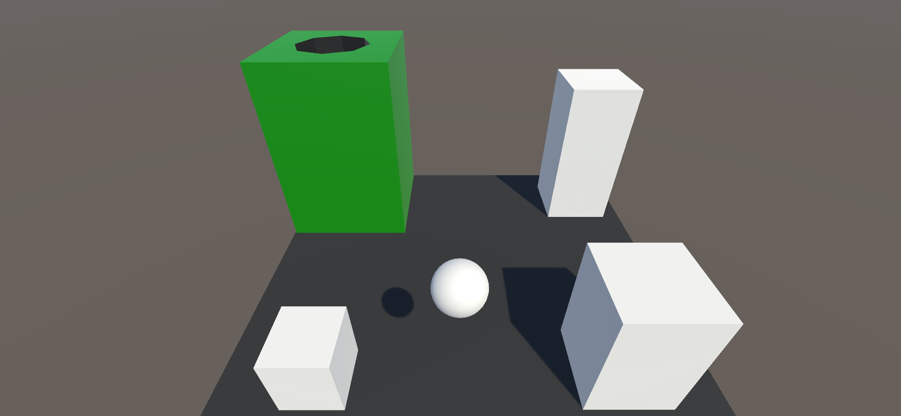
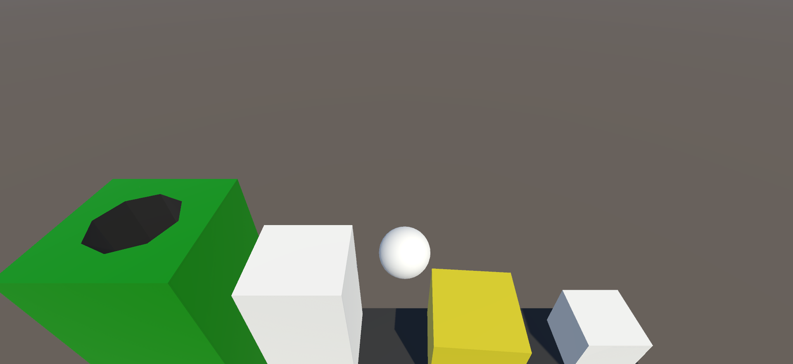
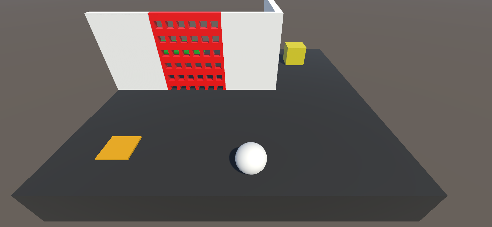

# Golf Game Prototype
A Level-based Puzzle/Platformer Prototype.

# Concept

A puzzle game where the player is tasked with solving quick but tricky levels using a multitude of mechanics that they are steadily introduced to throughout the levels. 

The player controls a ball that is navigating in 3d space around puzzling levels in order to get to the goal. The player will have to solve problems using mechanics such as pushing blocks onto pressure plates, platforming, and dashing about in order to reach the goal.

## Mechanics
- Three dimensional movement
- Interactive, momentum and weight based physics
- Puzzle mechanics - e.g. Pressure Plates
- Platforming Mechanics - e.g. Air-Dashing

